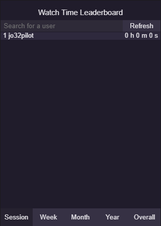

# Viewer Analytics
Viewer Analytics is a Twitch panel extension that displays viewer watch habits.\
\

## Capabilities
- Places viewers on a leaderboard based on time spent watching the streamer.
- Can have the leaderboard display session, weekly, monthly, yearly, and overall
  times.
- Clicking on a viewer's name draws a graph displaying their watch habits over 
  the past 10 days.
- Streamers can whitelist their viewers, effectively hiding them from normal
  viewing on the leaderboard.
- Search functionality allows users to look up any user, even those whitelisted.

# Testing Locally
If you want to test the server locally, you're going to need an SSL certificate 
for HTTPS capabilities. I used Let's Encrypt.\
The steps are as follows:\
1. Be sure you have the dependencies installed.
2. In the Viewer-Analytics folder, create a directory called **conf**.
3. Store your **private key** and **certificate chain** (if you're using Let's
   Encrypt, privkey.pem and fulllchain.pem) in **Viewer-Analytics/conf**.
4. Change directories to **Viewer-Analytics/backend**.
5. Use the provided **config-example.json** as a reference to create your own
   **config.json** file.
6. Run `node backend.js`
